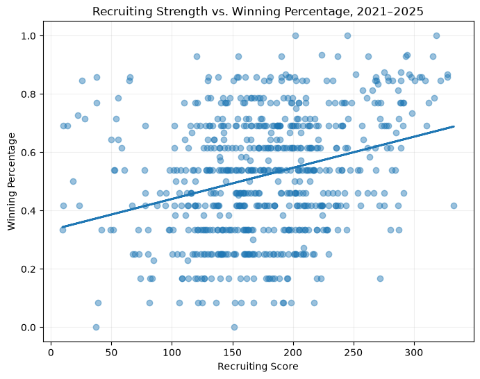
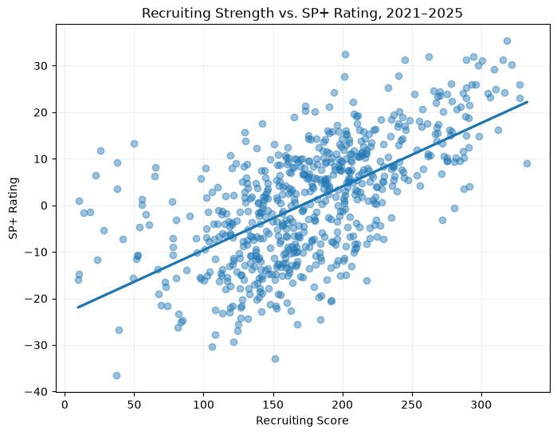

# College Football Recruiting and Team Success

## Research Question

**What is the relationship between a college football team's recruiting strength and its on-field success among FBS teams?**

A related question is:

**Do teams with higher-rated recruiting classes tend to have higher winning percentages and stronger overall team ratings?**

---

## 1. Problem Definition

College football recruiting is often used as a way to predict the future success of a program. Teams that consistently recruit highly rated players are generally expected to perform better on the field. However, strong recruiting does not automatically guarantee that a team will win games.

The purpose of this project is to examine the relationship between recruiting strength and on-field performance among FBS college football teams.

The main research question is:

**What is the relationship between a college football team's recruiting strength and its on-field success among FBS teams?**

A related question is whether teams with higher-rated recruiting classes tend to have higher winning percentages and stronger overall team ratings.

For this analysis, I measure team success using two main variables: **winning percentage** and **SP+ rating**.

Previous research has found a positive relationship between recruiting success and on-field performance in college football (Caro, 2012; Langelett, 2003). Research has also found that recruit quality is related to team performance even when differences between college football programs are considered (Bergman & Logan, 2016).

This question is relevant because recruiting rankings are widely used by college football fans, coaches, analysts, and media organizations when discussing the future strength of programs. Comparing recruiting results with actual team performance can help show how strongly recruiting strength is associated with success on the field.

---

## 2. Data Description

The data for this project comes from the **College Football Data API (CFBD)**.

College Football Data provides historical information about college football, including recruiting data, team records, rankings, and advanced team ratings.

Source: [College Football Data](https://collegefootballdata.com)

I collected data from the **2021, 2022, 2023, 2024, and 2025 college football seasons**.

Each observation in the final dataset represents one **FBS team during one season**, also called a team-season observation.

The team records dataset initially contained **664 FBS team-season observations**.

The recruiting dataset contained **978 observations** before being combined with the FBS team records.

After merging the FBS records and recruiting data, the dataset contained **663 team-season observations**.

SP+ data contained **669 observations** across the five seasons and was then merged into the main dataset.

The final analysis dataset contains:

- **663 rows**
- **11 columns**
- **0 missing values**

The final variables are:

- Season
- Team
- Conference
- Games
- Wins
- Losses
- Ties
- Winning percentage
- Recruiting rank
- Recruiting score
- SP+ rating

The data was collected through an API rather than manually entered or taken from a pre-built spreadsheet.

---

## 3. Variables and Important Context

### Recruiting Strength

**Conceptual definition:**  
Recruiting strength represents the overall quality of players recruited by a college football program.

**Operational definition:**  
Recruiting strength is measured using the **recruiting score** and **recruiting rank** provided by the College Football Data API.

A higher recruiting score represents a stronger recruiting class.

---

### Winning Percentage

**Conceptual definition:**  
Winning percentage represents the proportion of games a team wins during a season.

**Operational definition:**  
Winning percentage is calculated by dividing a team's total number of wins by its total number of games played.

`Winning Percentage = Wins / Games Played`

---

### Wins and Losses

**Conceptual definition:**  
Wins and losses represent the number of games a team won or lost during a season.

**Operational definition:**  
Wins and losses are taken from season-level team record data provided by the College Football Data API.

---

### SP+ Rating

**Conceptual definition:**  
SP+ is a numerical measure of overall team strength and performance.

**Operational definition:**  
SP+ rating is measured using the team rating provided through the College Football Data API.

A higher SP+ rating represents stronger overall team performance.

---

### Season

**Conceptual definition:**  
Season represents the college football season in which the team's performance occurred.

**Operational definition:**  
Season is represented by the year associated with each observation.

The analysis includes seasons from **2021 through 2025**.

---

### Team

**Conceptual definition:**  
Team represents an individual NCAA FBS college football program.

**Operational definition:**  
Teams are identified using the program names provided by the College Football Data API.

---

## 4. Data Cleaning and Preparation

Python and pandas were used to collect, inspect, clean, and combine the data.

The analysis began with **664 FBS team-season records** from the College Football Data API.

Recruiting data was collected separately and contained **978 observations**. The recruiting data included season, team, recruiting rank, and recruiting score.

The team records and recruiting datasets were merged using **team and season** as the matching variables.

After this merge, **663 of the original 664 FBS team-season records remained** in the dataset.

SP+ ratings were then collected separately and merged into the main dataset using team and season.

The main data preparation steps included:

1. Collecting team records for the 2021 through 2025 seasons.
2. Restricting the team records to FBS programs.
3. Selecting the variables relevant to the research question.
4. Collecting recruiting rank and recruiting score data.
5. Checking each dataset for missing values.
6. Checking for duplicate observations.
7. Combining the recruiting and team record datasets using team and season.
8. Calculating winning percentage using wins divided by games played.
9. Collecting SP+ team ratings.
10. Combining SP+ ratings with the main dataset.
11. Checking the final dataset for missing values.

The final dataset contains **663 observations and 11 variables**.

There were **no missing values in any of the final variables used in the analysis**.

---

## 5. Visualizations and Insights

### Visualization 1: Recruiting Strength and Winning Percentage

The first visualization compares **recruiting score** with **season winning percentage** for FBS teams from 2021 through 2025.

Each point represents one team during one season.

A trend line was included to make the overall relationship easier to see.

**X-axis:** Recruiting Score  
**Y-axis:** Winning Percentage

The scatter plot shows a positive relationship between recruiting strength and winning percentage. Teams with higher recruiting scores generally tended to have higher winning percentages, although there was still a large amount of variation.

The correlation between recruiting score and winning percentage was **0.300**.

This suggests a positive but relatively modest relationship. Stronger recruiting is associated with more winning, but recruiting strength alone does not explain most of the differences in team records.

There are also teams with relatively low recruiting scores that produced strong winning percentages, as well as highly rated recruiting teams that did not produce especially strong records. This suggests that other factors also influence season outcomes.

---

### Visualization 2: Recruiting Strength and SP+ Rating

The second visualization compares **recruiting score** with **SP+ rating**.

Each point again represents one FBS team during one season.

A trend line was included to show the overall direction of the relationship.

**X-axis:** Recruiting Score  
**Y-axis:** SP+ Rating

The relationship between recruiting score and SP+ rating appears considerably stronger than the relationship between recruiting score and winning percentage.

The correlation between recruiting score and SP+ rating was **0.624**.

This represents a moderately strong positive relationship.

Teams with stronger recruiting classes generally tended to have stronger SP+ ratings. The observations also follow the upward trend more closely than they do in the winning percentage visualization.

These results suggest that recruiting strength may be more closely related to a team's overall quality than to its raw win-loss record.

---

## 6. Storytelling and Conclusions

The results show that recruiting strength is positively associated with success in college football, but the strength of that relationship depends on how success is measured.

Recruiting score had a correlation of **0.300 with winning percentage**. This means teams with stronger recruiting classes generally tended to win more games, but the relationship was not especially strong.

The relationship between recruiting score and SP+ rating was considerably stronger, with a correlation of **0.624**.

This suggests that stronger recruiting is more closely associated with overall team quality than with a team's raw winning percentage.

One possible explanation is that winning percentage can be affected by many factors besides the overall quality of a team. Teams play different schedules, compete in different conferences, experience injuries, play close games, and may face very different levels of competition.

SP+ is designed to represent overall team performance rather than only wins and losses. This may help explain why recruiting strength has a stronger relationship with SP+ than with winning percentage.

Overall, the results suggest that strong recruiting is an important part of college football success. Teams with stronger recruiting classes generally perform better, especially when overall team strength is considered.

However, recruiting alone does not guarantee a successful season.

Because this project is observational, these results should not be interpreted as proof that stronger recruiting directly causes better team performance.

---

## 7. Limitations, Ethics, and Reflection

There are several limitations to this analysis.

First, recruiting rankings and recruiting scores are estimates of player talent. They are not perfect measurements of how good a player will eventually become in college.

Some highly rated recruits may not develop as expected, while lower-rated recruits may become highly successful college players.

Another limitation is that college football teams do not play identical schedules. Some programs play much stronger opponents than others. Because of this, winning percentage does not necessarily represent the same level of team quality for every program.

This project also does not directly account for factors such as:

- Coaching quality
- Player development
- Injuries
- Transfer portal additions
- Transfer portal losses
- Strength of schedule
- Conference strength
- Coaching changes
- Player playing time
- Players leaving early for professional football

Another limitation involves the timing of recruiting classes.

Players usually remain with a college football program for multiple seasons. This means a team's success during one season may be influenced by several previous recruiting classes rather than only the recruiting class associated with that particular year.

From an ethical perspective, recruiting ratings should also be interpreted carefully. A recruiting rating is an estimate of an athlete's ability at a particular point in time and should not be treated as a complete measure of that player's ability, value, intelligence, effort, or future success.

The findings from this project describe relationships between recruiting measures and team performance. They should not be used to make overly broad conclusions about individual athletes.

If I had more time and additional data, I would like to examine multiple previous recruiting classes together and account for variables such as strength of schedule, transfer portal activity, coaching changes, and conference strength.

---

## 8. References

### Data Source

College Football Data. (n.d.). *College Football Data*.  
https://collegefootballdata.com

### Peer-Reviewed Academic Sources

Bergman, S. A., & Logan, T. D. (2016). The effect of recruit quality on college football team performance. *Journal of Sports Economics, 17*(6), 578–600. https://doi.org/10.1177/1527002514538266

Caro, C. A. (2012). College football success: The relationship between recruiting and winning. *International Journal of Sports Science & Coaching, 7*(1), 139–152. https://doi.org/10.1260/1747-9541.7.1.139

Langelett, G. (2003). The relationship between recruiting and team performance in Division 1A college football. *Journal of Sports Economics, 4*(3), 240–245. https://doi.org/10.1177/1527002503253478

---

## 9. Code and AI Transparency

The complete Python code used to collect, clean, analyze, and visualize the data for this project is available through the project's GitHub repository.

[View the Jupyter Notebook](project1.ipynb)

The analysis was completed using Python with libraries including pandas, requests, matplotlib, and NumPy.

### AI Usage Disclosure

I used OpenAI ChatGPT (GPT-5.6) during this project to help interpret the assignment requirements, organize the structure of the project, troubleshoot Python code, and improve explanations of analytical decisions.

I reviewed the generated suggestions and am responsible for the final code, analysis, visualizations, and written content included in this project.
