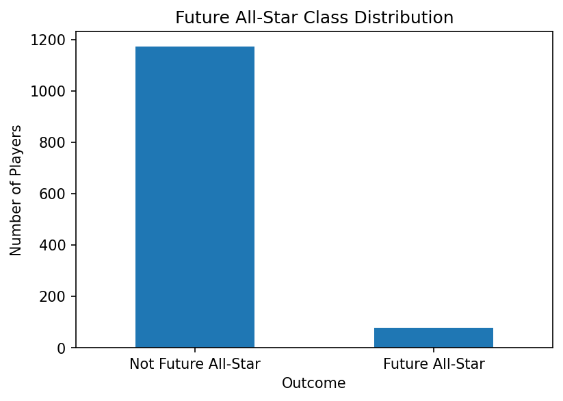
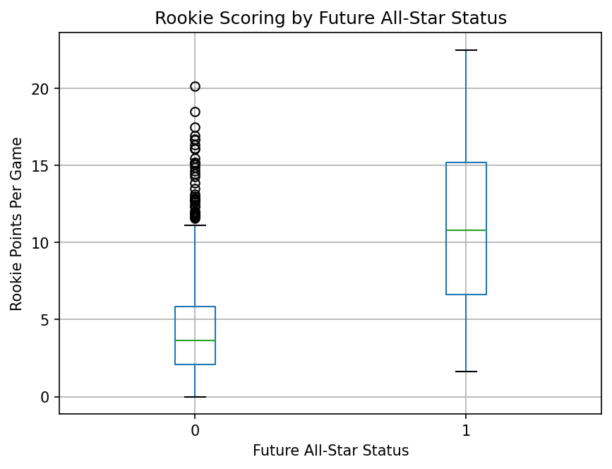
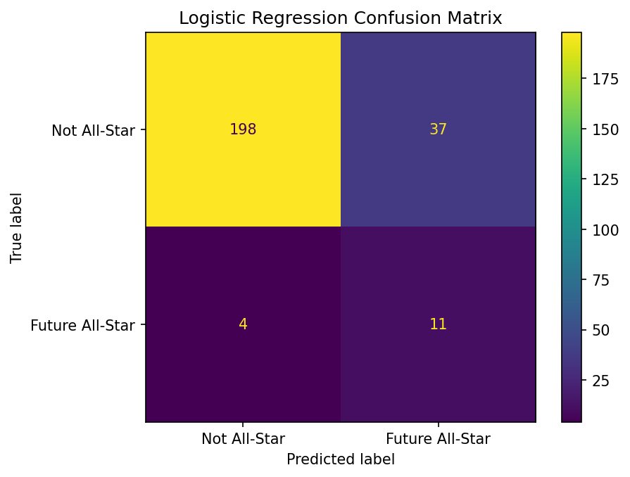
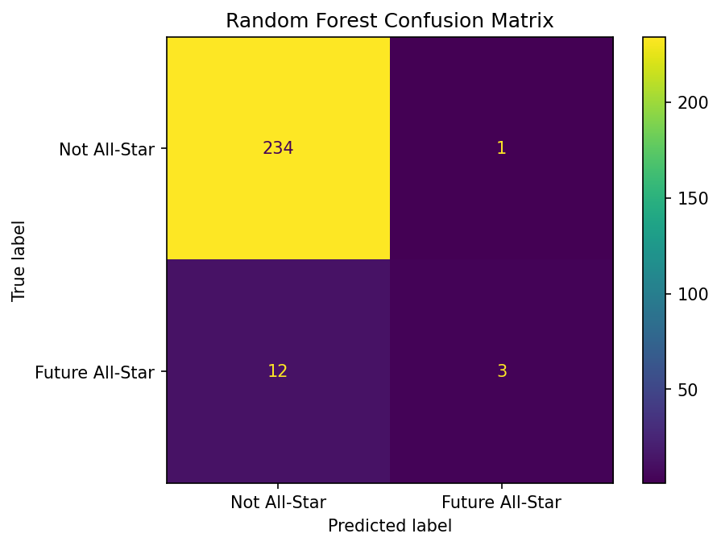
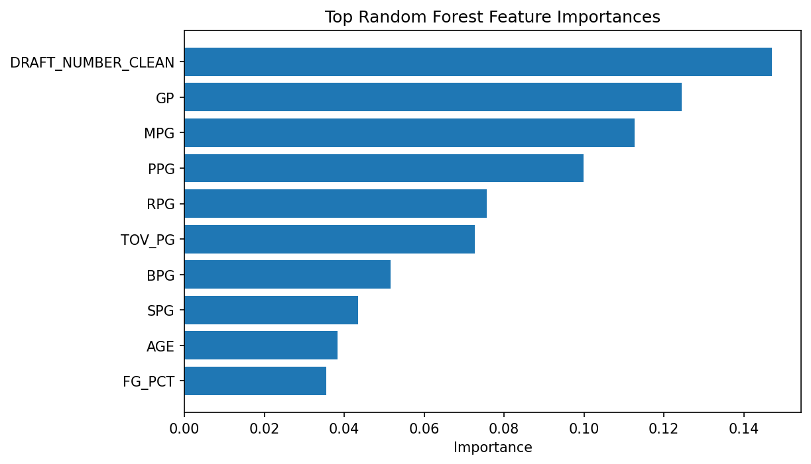
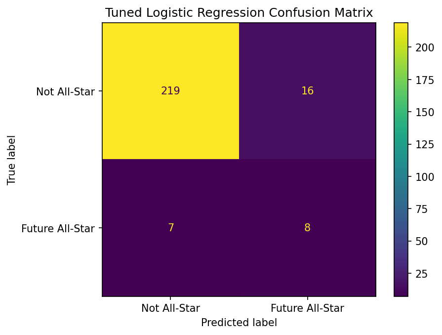

# Project Two: Predicting Future NBA All-Stars

## Problem Definition

The goal of this project is to answer the following question:

**Can an NBA player's rookie-season statistics and draft position predict whether they will become an NBA All-Star within their first seven seasons?**

This is a binary classification problem. The target variable is `future_all_star`.

- `1` = the player became an NBA All-Star within the first seven seasons of their career
- `0` = the player did not become an NBA All-Star within that period

This problem is meaningful because NBA teams invest significant time and resources into evaluating young players. Being able to identify statistical patterns associated with future high-level players could be useful in scouting and player evaluation. However, the model in this project is intended as an analytical experiment rather than a replacement for professional scouting.

## Background and Context

Predicting future NBA success is difficult because player development depends on many factors that are not completely captured by traditional statistics.

Previous research has shown that past basketball performance can provide useful information about future professional success. Coates and Oguntimein (2010) studied whether college production could predict NBA career outcomes and found that some measures of college productivity were related to draft position and later professional performance.

Moxley and Towne (2015) examined the prediction of early NBA career success and found that factors such as age, previous performance, and the quality of a player's college program helped distinguish stronger professional career trajectories. Their results also showed that statistical models could provide information beyond draft order alone.

Berger and Daumann (2021) studied NBA Draft Combine information and found that athletic testing can influence where players are drafted even though some combine measurements have limited ability to predict later NBA performance. This demonstrates that player evaluation involves uncertainty and that draft position should not be treated as a perfect measure of future ability.

These studies helped motivate my decision to combine rookie production, efficiency statistics, age, and draft position rather than relying on only one measure of player quality.

## Data Description

The data for this project was collected using the `nba_api` Python package, which provides access to NBA.com statistics endpoints.

The dataset includes NBA rookies from the 2003-04 through 2018-19 seasons. These seasons were selected so that players would have enough time to complete the seven-season prediction window.

Each observation represents one NBA player's rookie season.

The final dataset contained **1,250 players**.

The target variable was `future_all_star`, which indicates whether a player became an NBA All-Star during their first seven seasons.

The final modeling features were:

- Points per game
- Rebounds per game
- Assists per game
- Steals per game
- Blocks per game
- Turnovers per game
- Minutes per game
- Games played
- Field-goal percentage
- Three-point percentage
- Free-throw percentage
- Age
- Draft position
- Points per 36 minutes
- Rebounds per 36 minutes
- Assists per 36 minutes
- True shooting percentage

Several of the per-game, per-36-minute, and efficiency statistics were engineered from the original NBA data.

## Data Understanding and Exploration

The target variable was highly imbalanced.

Out of 1,250 players:

- **1,173 players (93.84%)** did not become an All-Star within their first seven seasons.
- **77 players (6.16%)** did become an All-Star.

This imbalance was important because a model could achieve very high accuracy simply by predicting that almost every player would not become an All-Star.

Rookie scoring also showed a visible relationship with future All-Star status. Players who eventually became All-Stars generally had higher rookie points-per-game values, although there was still considerable overlap between the two groups.

The exploratory analysis suggested that early playing time, production, draft position, and efficiency could all contain useful predictive information.

## Data Preparation and Feature Selection

Several preprocessing steps were performed before modeling.

Per-game statistics were calculated from season totals, including points, rebounds, assists, steals, blocks, turnovers, and minutes per game.

I also created per-36-minute statistics for points, rebounds, and assists. True shooting percentage was calculated to provide an additional measure of scoring efficiency.

Draft position required additional cleaning. Standard NBA draft selections range from 1 through 60. Missing, undrafted, or nonstandard draft values were assigned a value of 61 so that they could remain in the numerical feature set while being distinguishable from drafted players.

True shooting percentage contained 13 missing values. Instead of filling these values before separating the data, median imputation was performed inside the model pipeline. This allowed the imputer to learn only from the training data and helped prevent data leakage.

The data was divided into an 80% training set and a 20% test set using a stratified split. Stratification preserved approximately the same percentage of future All-Stars in both sets.

Logistic Regression also used standardized features through `StandardScaler`. Scaling and imputation were placed inside the modeling pipeline so that preprocessing was learned only from the training data.

## Baseline and Model Development

Because the classes were heavily imbalanced, I first created a baseline classifier that always predicted the most common class.

The baseline achieved:

- **Accuracy: 94.0%**
- **Precision: 0.0%**
- **Recall: 0.0%**
- **F1 Score: 0.0%**

Although 94% accuracy appears strong, the baseline failed to identify a single future All-Star. This demonstrates why accuracy alone is not an appropriate measure for this project.

I then trained two machine-learning models:

1. Logistic Regression
2. Random Forest Classifier

Both models used class balancing because future All-Stars represented only a small portion of the dataset.

Logistic Regression was useful because it provides interpretable coefficients and produces probability estimates.

Random Forest was useful because it can model nonlinear relationships and interactions between features without assuming that relationships are linear.

## Model Evaluation and Selection

The Logistic Regression model produced the following results:

- **Accuracy: 83.6%**
- **Precision: 22.9%**
- **Recall: 73.3%**
- **F1 Score: 34.9%**
- **ROC-AUC: 85.3%**

Its confusion matrix showed:

- 198 true negatives
- 37 false positives
- 4 false negatives
- 11 true positives

The Random Forest model produced:

- **Accuracy: 94.8%**
- **Precision: 75.0%**
- **Recall: 20.0%**
- **F1 Score: 31.6%**
- **ROC-AUC: 82.0%**

Its confusion matrix showed:

- 234 true negatives
- 1 false positive
- 12 false negatives
- 3 true positives

Although Random Forest had higher accuracy and precision, it identified only 3 of the 15 future All-Stars in the test set.

Logistic Regression identified 11 of the 15 future All-Stars.

For this problem, I selected **Logistic Regression as the final model** because identifying potential future All-Stars was more important than maximizing overall accuracy. Logistic Regression had substantially higher recall, a higher F1 score, and a higher ROC-AUC.

I also explored different classification probability thresholds for Logistic Regression. A threshold of 0.75 produced a higher F1 score in the test-set experiment. However, because this threshold was selected after examining test-set performance, I treated this analysis as an exploratory extension rather than reporting it as an unbiased final test result. A future version of the project could tune the threshold using a separate validation set or cross-validation.

## Model Interpretation and Insights

Random Forest feature importance showed that draft position was the most influential feature in that model.

Other important features included games played, minutes per game, points per game, rebounds per game, and turnovers per game.

The Logistic Regression coefficients also provided insight into the predictions.

Rookie points per game had the largest positive coefficient, suggesting that stronger early scoring production was associated with a greater predicted probability of becoming an All-Star.

Games played and field-goal percentage also had strong positive coefficients.

Draft position had a negative coefficient. Because lower draft numbers represent earlier selections, this result means that players selected earlier in the draft were generally more likely to be predicted as future All-Stars.

Some variables, including minutes per game, points per 36 minutes, and true shooting percentage, had negative coefficients even though they would normally be expected to represent positive basketball performance.

These values should be interpreted cautiously because many of the predictors are strongly related to each other. For example, points per game, minutes per game, and points per 36 minutes contain overlapping information. When correlated predictors are included together in Logistic Regression, individual coefficient signs can become difficult to interpret.

The model therefore shows associations rather than proving that any individual statistic causes a player to become an All-Star.

## Limitations, Ethics, and Reflection

One major limitation of the project is class imbalance. Only 77 of the 1,250 players became All-Stars within seven seasons. The test set contained only 15 future All-Stars, meaning that a difference of only a few predictions can noticeably change precision and recall.

The project also relies primarily on traditional rookie-season statistics. NBA development depends on many factors that are not represented in the model, including injuries, coaching, team situation, defensive responsibilities, work ethic, role changes, and player development.

Several predictors also measure similar aspects of performance. This multicollinearity makes individual Logistic Regression coefficients more difficult to interpret.

Draft information required assumptions as well. Undrafted or nonstandard draft values were represented as 61. This allows those players to remain in the model but simplifies differences between various undrafted players.

There was also a data-collection limitation involving some players whose All-Star endpoint did not return the expected result set. These players were treated as having no recorded All-Star seasons. This assumption should be considered when interpreting the results.

Another limitation is the train/test strategy. The project used a random stratified split across players. A stronger future test could train models using older rookie classes and evaluate them only on later rookie classes. That would more closely represent making predictions about future players.

False positives would occur when the model predicts that a player will become an All-Star but the player does not. In a real scouting situation, overconfidence in these predictions could lead to poor personnel decisions.

False negatives may be even more important because they represent players who eventually become All-Stars but were predicted not to. A team relying too heavily on such a model could overlook a valuable player.

For these reasons, the model should be used as an additional analytical tool rather than as a replacement for scouts, coaches, medical information, and other forms of player evaluation.

## Code and Transparency

The complete Python analysis is available in the Jupyter Notebook:

[View the Project Two Jupyter Notebook](project2.ipynb)

The project used the `nba_api` Python package to access NBA.com statistical data.

### AI Usage Disclosure

I used OpenAI ChatGPT (GPT-5.6) during this project to help interpret assignment requirements, create a list of the order of tasks required for the project, to keep me on a straight path, and explain coding errors . I came up with the topic, wrote my own code, I ran and reviewed the analysis, reviewed the outputs, and made all decisions regarding the models, features, interpretation, and presentation of the project.

## References

Berger, T., & Daumann, F. (2021). Jumping to conclusions—An analysis of the NBA Draft Combine athleticism data and its influence on managerial decision-making. *Sport, Business and Management: An International Journal, 11*(5), 515–534. https://doi.org/10.1108/SBM-11-2020-0117

Coates, D., & Oguntimein, B. (2010). The length and success of NBA careers: Does college production predict professional outcomes? *International Journal of Sport Finance, 5*(1), 4–26. https://doi.org/10.1177/155862351000500101

Moxley, J. H., & Towne, T. J. (2015). Predicting success in the National Basketball Association: Stability & potential. *Psychology of Sport and Exercise, 16*, 128–136. https://doi.org/10.1016/j.psychsport.2014.07.003

swar/nba_api contributors. (n.d.). *nba_api: An API client package to access the APIs of NBA.com* [Computer software]. GitHub.
